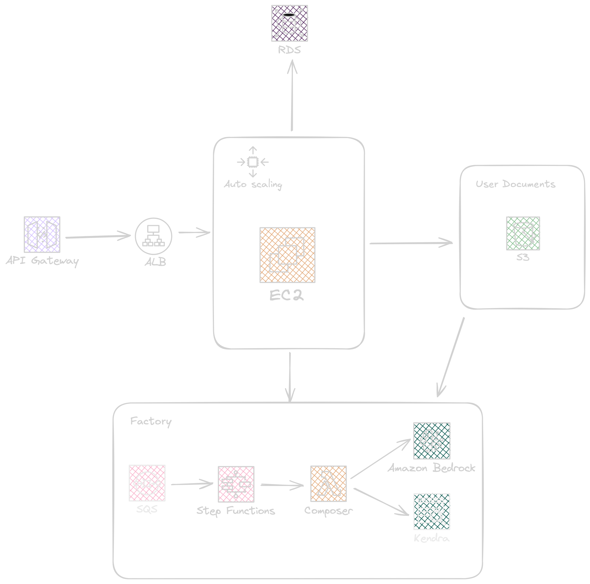
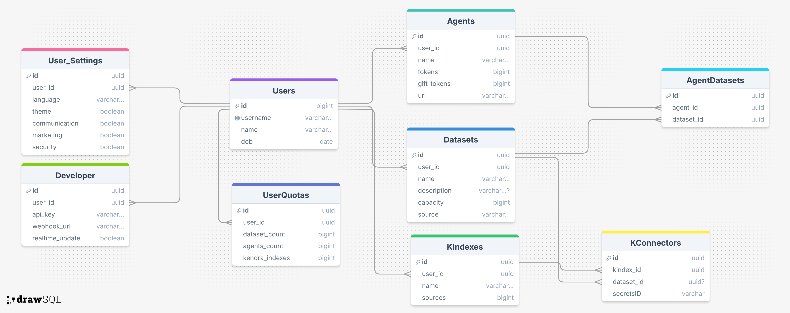

# Enyx Composer 🎻 [](https://github.com/JEpifanio90/EnyxComposer/actions/workflows/rust.yml)

<div align="center">
    
</div>

## Description

Enyx is a SaaS platform designed for efficient data processing and conversion, transforming raw data into consumable JSON or Markdown files. It also empowers users to train custom Large Language Model (LLM) agents using their processed data. This CDK project automates the deployment of Enyx's infrastructure on AWS, enabling seamless scalability and cost-effectiveness.

<div align="center">
    
</div>

### Features

- **Automated Infrastructure Deployment:** Uses AWS CDK to define and deploy the entire Enyx architecture, including Lambda functions, S3 buckets, API Gateway, and more.
- **Data Processing Pipeline:** Orchestrates data extraction, analysis, and transformation using Lambda functions and AWS AI services (Rekognition, Transcribe, Polly, Textract, Comprehend).
- **LLM Training Integration:** Facilitates the creation of knowledge bases from user data stored in S3 and supports the training of custom LLM agents.
- **Serverless Architecture:** Ensures pay-per-use billing and automatic scaling with AWS Lambda, SQS, and other serverless services.
- **API Gateway for External Access:** Provides a secure and scalable API for external users to access processed data and initiate LLM training.
- **Robust Task Management:** Utilizes SQS and Step Functions (if needed) for managing asynchronous tasks and complex workflows.
- **S3 Storage:** Leverages S3 for storing raw data, processed outputs, and model artifacts.
- **RDS for Metadata:** Uses RDS to store structured data related to processing tasks and model training.

### Built with

- **AWS CDK (Cloud Development Kit):** Infrastructure as code framework for defining and deploying cloud resources using familiar programming languages.
- **GO:** Programming language for serverless Lambdas, providing efficient and performant data processing.

<div align="center">
    
</div>

## Getting started

To deploy Enyx using this CDK project, you will need:

1.  **AWS Account:** An active AWS account with appropriate permissions.
2.  **AWS CLI:** Installed and configured with your AWS credentials.
3.  **Node.js and npm:** Required for CDK.
4.  **Go:** Installed for building Lambda functions.

**Steps:**

1.  **Clone the Repository:**
    ```bash
    git clone <repository_url>
    cd enyx-cdk
    ```

2.  **Install Dependencies:**
    ```bash
    npm install
    ```

3.  **Bootstrap CDK:**
    ```bash
    cdk bootstrap aws://ACCOUNT-NUMBER/REGION
    ```
    (Replace `ACCOUNT-NUMBER` and `REGION` with your AWS account ID and region.)

4.  **Deploy the Stack:**
    ```bash
    cdk deploy
    ```

    Follow the prompts to deploy the Enyx infrastructure.

5.  **Configure Environment Variables:**
    Set necessary environment variables for Lambda functions and other resources.

6.  **Access the API:**
    After deployment, access the API Gateway endpoint to interact with the Enyx platform.

### To-do

- [ ] Implement user authentication and authorization.
- [ ] Better error handling
- [ ] Implement webhook functionality for external users.
- [ ] Document API endpoints for external users.